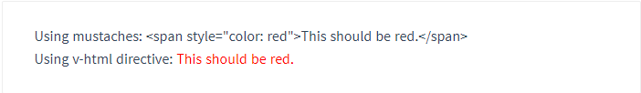

双大括号会将数据解释为普通文本，而非 HTML 代码。为了输出真正的 HTML，你需要使用 `v-html`指令：

```html
<p>Using mustaches: {{ rawHtml }}</p>
<p>Using v-html directive: <span v-html="rawHtml"></span></p>
```



这个 `span` 的内容将会被替换成为属性值 `rawHtml`，直接作为 HTML——会忽略解析属性值中的数据绑定。注意，你不能使用 `v-html` 来复合局部模板，因为 Vue 不是基于字符串的模板引擎。反之，对于用户界面 (UI)，组件更适合作为可重用和可组合的基本单位。


> 你的站点上动态渲染的任意 HTML 可能会非常危险，因为它很容易导致 [XSS 攻击](https://en.wikipedia.org/wiki/Cross-site_scripting)。请只对可信内容使用 HTML 插值，**绝不要**对用户提供的内容使用插值。


