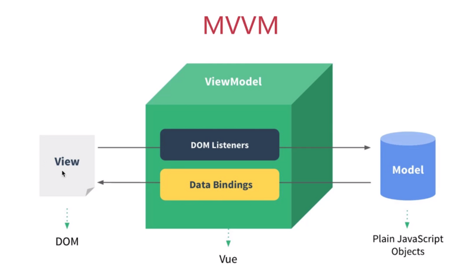

* [MVVM框架理解及其原理实现](https://segmentfault.com/a/1190000015895017 )


## what 

### MVC框架


将整个前端页面分成View，Controller，Modal，视图上发生变化，通过Controller（控件）将响应传入到Model（数据源），由数据源改变View上面的数据。

整个过程看起来是行云流水，业务逻辑放在Model当中，页面渲染逻辑放在View当中，但在实际运用上却存在一个问题：那就是**MVC框架允许View和Model直接进行通信！！**

换句话说，View和Model之间随着业务量的不断庞大，会出现蜘蛛网一样难以处理的依赖关系，完全背离了开发所应该遵循的**“开放封闭原则”**。

### MVVC

面对这个问题，MVVM框架就出现了，它与MVC框架的主要区别有两点： 

**1、实现数据与视图的分离** 

**2、通过数据来驱动视图，开发者只需要关心数据变化，DOM操作被封装了。** 



可以看到MVVM分别指View，Model，View-Model，View通过View-Model的DOM Listeners将事件绑定到Model上，而Model则通过Data Bindings来管理View中的数据，View-Model从中起到一个连接桥的作用。 

## where

### 1. MVVM的实现主要是三个核心点： 

1. **响应式：vue如何监听data的属性变化**
2. **模板解析：vue的模板是如何被解析的**
3. **渲染：vue模板是如何被渲染成HTML的**


## how

### 1响应式：

* 对于MVVM来说，data一般是放在一个对象当中，就比如这样：

```js
var obj = {
    name: 'zhangsan',
    age: 25
}
```

* 当我们访问或修改obj的属性的时候，比如： 

```js
console.log（obj.name）  //访问
obj.age = 22            //修改
```

* 但是这样的操作vue本身是没有办法感知到的，那么应该如何让vue知道我们进行了访问或是修改的操作呢？ 那就要使用Object.defineProperty

```js
var vm = {}
var data = {
    name: 'zhangsan',
    age: 20
}

var key, value
for (key in data) {
    (function (key) {
        Object.defineProperty(vm, key, {
            get: function () {
                console.log('get', data[key]) // 监听
                return data[key]
            },
            set: function (newVal) {
                console.log('set', newVal) // 监听
                data[key] = newVal
            }
        })
    })(key)
}

```

* 通过Object.defineProperty将data里的每一个属性的访问与修改都变成了一个函数，在函数get和set中我们即可监听到data的属性发生了改变。 

### 2 模板解析：

* 首先模板是什么？

  * 模板本质上是一串字符串，它看起来和html的格式很相像，实际上有很大的区别，因为模板本身还带有逻辑运算，比如v-if，v-for等等，但它最后还是要转换为html来显示。

  ```html
      <div id="app">
          <div>
              <input v-model="title">
              <button v-on:click="add">submit</button>
          </div>
          <div>
              <ul>
                  <li v-for="item in list">{{item}}</li>
              </ul>
          </div>
      </div>
  ```

> 模板在vue中必须转换为JS代码，原因在于：在前端环境下，只有JS才是一个图灵完备语言，才能实现逻辑运算，以及渲染为html页面。

这里就引出了vue中一个特别重要的函数——**render**

render函数中的核心就是with函数。

> with函数将某个对象添加到作用域链的顶部，如果在 statement中有某个未使用命名空间的变量，跟作用域链中的某个属性同名，则这个变量将指向这个属性值。 

```js
       var obj = {
            name: 'zhangsan',
            age: 20,
            getAddress: function () {
                alert('beijing')
            }
        }
        function fn1() {
            with(obj) {
                alert(age)
                alert(name)
                getAddress()
            }
        }
        fn1()
```

with将obj这个对象放在了自己函数的作用域链的顶部，当执行下列函数时，就会自动到obj这个对象去寻找同名的属性。

而在render函数中，with的用法是这样：

```html
    <div id="app">
        <div>
            <input v-model="title">
            <button v-on:click="add">submit</button>
        </div>
        <div>
            <ul>
                <li v-for="item in list">{{item}}</li>
            </ul>
        </div>
    </div>
```

```js
        // 对应的js文件
        var data = {
            title: '',
            list: []
        }
        // 初始化 Vue 实例
        var vm = new Vue({
            el: '#app',
            data: data,
            methods: {
                add: function () {
                    this.list.push(this.title)
                    this.title = ''
                }
            }
        })

        
        with(this){  // this 就是 vm
            return _c(
                'div',
                {
                    attrs:{"id":"app"}
                },
                [
                    _c(
                        'div',
                        [
                            _c(
                                'input',
                                {
                                    directives:[
                                        {
                                            name:"model",
                                            rawName:"v-model",
                                            value:(title),
                                            expression:"title"
                                        }
                                    ],
                                    domProps:{
                                        "value":(title)
                                    },
                                    on:{
                                        "input":function($event){
                                            if($event.target.composing)return;
                                            title=$event.target.value
                                        }
                                    }
                                }
                            ),
                            _v(" "),
                            _c(
                                'button',
                                {
                                    on:{
                                        "click":add
                                    }
                                },
                                [_v("submit")]
                            )
                        ]
                    ),
                    _v(" "),
                    _c('div',
                        [
                            _c(
                                'ul',
                                _l((list),function(item){return _c('li',[_v(_s(item))])})
                            )
                        ]
                    )
                ]
            )
        }
```

* 在一开始，**因为new操作符，所以this指向了vm**，通过with我们将vm这个对象放在作用域链的顶部，因为在函数内部我们会多次调用vm内部的属性，所以使用with可以缩短变量长度，提供系统运行效率。 


* 其中的_c函数表示的是创建一个新的html元素，其基本用法为： 

```js
_c(element,{attrs},[children...])
```

其中的element表示所要创建的html元素类型，attrs表示所要创建的元素的属性，children表示该html元素的子元素。

_v函数表示创建一个文本节点，_l函数表示创建一个数组。

最终render函数返回的是一个虚拟DOM。


### 3. 如何将模板渲染为html

* 模板渲染为html分为两种情况，第一种是初次渲染的时候，第二种是渲染之后数据发生改变的时候，它们都需要调用updateComponent,其形式如下： 

```js
vm._update(vnode){
  const prevVnode = vm._vnode
  vm._vnode = vnode
  if (!prevVnode){
    vm.$el = vm.__patch__(vm.$el,vnode)
  } else {
    vm.$el = vm.__patch__(prevVnode,vnode)
  }
}

function updateComponent(){
  vm._update(vm._render())
}
```

* 首先读取当前的虚拟DOM——vm._vnode,判断其是否为空，若为空，则为初次渲染，将虚拟DOM全部渲染到所对应的容器当中（vm.$el），若不为空，则是数据发生了修改，通过响应式我们可以监听到这一情况，使用diff算法完成新旧对比并修改。 


## why


## how much

